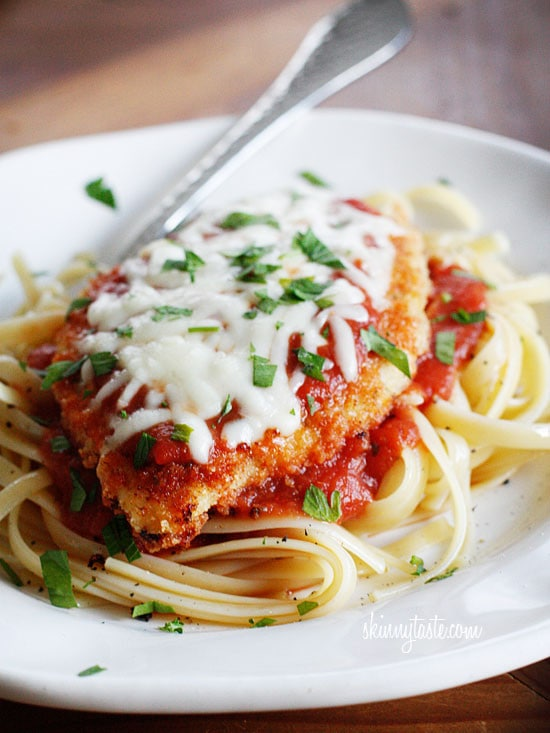

# About

My favorite food that I make occasionally for dinner. I make baked chicken parmeasan.

- **Prep:** 25 mins
- **Cook:** 40 mins
- **Total:** 1 h 5 mins
- **Servings:** 4 Servings
- **Total Cost** $x.x

# Ingredients

- 1/4 cup of extra virgin olive oil, plus 3 tablespoons
- 2 garlic cloves. minced
- 1/2 bunch fresh basil leaves
- 2(28-ounce) cans whole peeled tomatoes drained and hand crushed
- Pinch of sugar 
- Kosher salt and freshly ground pepper
- 4 skinless, boneless, chicken breasts (about 1 1/2 lbs)
- 1/2 cup of all-purpose flour
- 2 large eggs, lightly beaten
- 1 tablespoon of water
- 1 cup of dried bread crumbs
- 1 (8-ounce) ball fresh buffalo mozzarella, water drained
- Freshly grated parmesan
- 1 lbs spaghetti pasta, cooked al dente

# Directions
1. Coat a saute pan with olive oil and place over medium heat. When the oil gets hazy add garlic; cook and stir for 5 minutes until fragrant and soft.
2. Add some hand-torn basil. Carefully add the tomatoes (nothing splashes like tomatoes), cook and stir until the liquid is cooked down and the sauce is thick, about 15 minutes; season with sugar, salt and pepper.
3. Lower the heat, cover, and keep warm.
4. Preheat the oven to 450 degrees F.
5. Get the ingredients together for the chicken. Put the chicken breasts side by side on a cutting board and lay a piece of plastic wrap over them. 
6. Pound the chicken breasts with a flat meat mallet, until they are about 1/2-inch thick.
7. Put the flour in a shallow platter and season with a fair amount of salt and pepper; mix with a fork to distribute evenly.
8. In a wide bowl, combine the eggs and water, beat until frothy. Put the bread crumbs on a plate, season with salt and pepper.
9. Heat 3 tablespoons of olive oil over medium-high flame in a large oven-proof skillet.
10. Lightly dredge both sides of the chicken cutlets in the seasoned flour, and then dip them in the egg wash to coat completely, letting the excess drip off, then dredge in the bread crumbs.
11. When the oil is nice and hot, add the cutlets and fry for 4 minutes on each side until golden and crusty, turning once.
12. Ladle the tomato-olive sauce over the chicken and sprinkle with mozzarella, Parmesan, and basil. 
13. Bake the Chicken Parmesan for 15 minutes or until the cheese is bubbly. Serve hot with spaghetti.

# Notes
If you would like to you may choose a certain kind of bread crumb, or different kind of tomatoes depneding on your prference.
